## About me

I'm a brazilian web developer based in São Sebastião da Amoreira, Paraná, a pretty small town with only 8.5k citizens.  
I started my carrer working as a web designer back in 2010, then migrated to frontend development with the help of a friend/professor/boss.  
On my free time I generally stay with my two kids and on my free free time, I like to play online (mainly counter-strike).  

## Educational experience

I'm a Advertisement and Marketing graduate with post-graduation courses on Multimedia Arts Direction (UNOPAR) and Web Development (UTFPR).  
I also have a MBA on Project management (SENAI).  

## Professional experience

My current stack is heavy on React with typescript and Nextjs, but sometimes I need to work on PHP and even Go.  
I worked with a lot of different technologies on the past, like: Vuejs, Nuxtjs, Emberjs, Electron, React Native, Flutter, Thymeleaf, Wordpress, Woocommerce, Backbonejs with Marionette, Magento and others.  
I also have experience on design tools like Photoshop, Sketch, Figma and Illustrator.  
  
I've worked for companies with a lot of clients from different areas, going from brazilian singers and bands, through non-governamental institutions like ONU, to big companies across the globe like Mc Donald's, Samsung, Volkswagen, Amstel, etc. I also worked on web, desktop and mobile apps.  

```mermaid

gantt
dateFormat  YYYY-MM-DD
todayMarker off
title Companies I've worked for

section Carreer
Cedilha Comunicação                   :active,, 2010-05-01,2012-05-01
Bis2Bis                               :active,, 2012-05-01,2013-06-01
Advise                                :active,, 2013-06-01,2014-03-01
ICOMP Agência Digital                 :active,, 2014-03-01,2016-03-01
Estúdio FFW                           :active,, 2016-03-01,2017-06-01
Uniware                               :active,, 2017-06-01,2018-07-01
Slingshot Digital                     :active,, 2018-07-01,2019-07-01
Farmbits - Belagrícola                :active,, 2019-07-01,2021-05-01
Gamers Club                           :active,, 2021-05-01,2022-10-19
```

## Connect

    
    
    
    
    

  

  
Thanks for stopping by 🤜🤛
